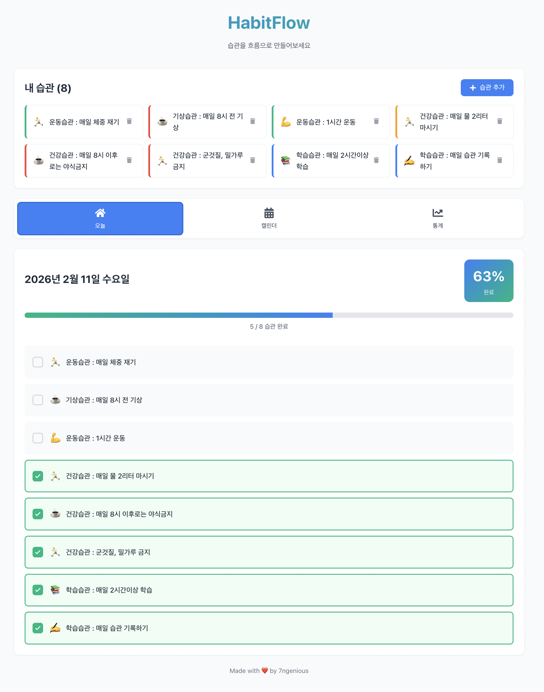
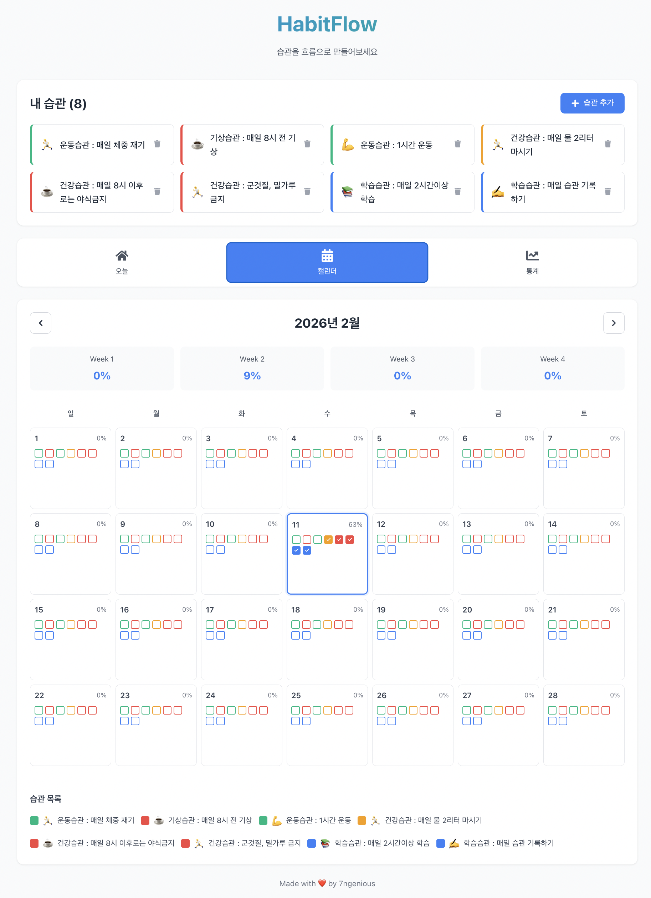
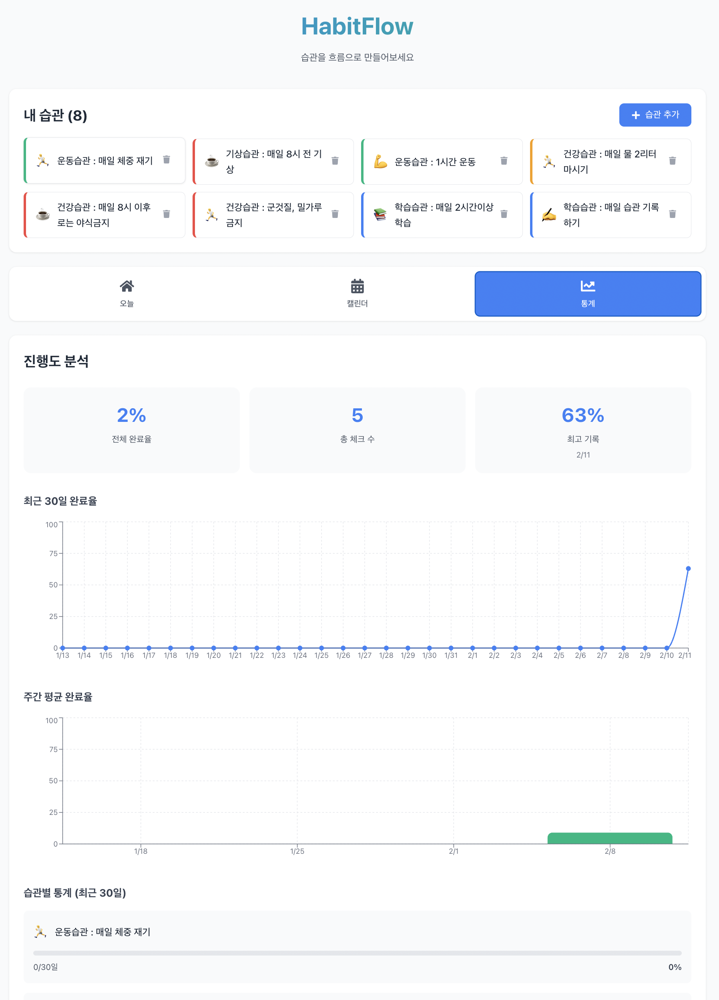

# 🌊 HabitFlow

> 습관을 흐름으로 만들어보세요

**HabitFlow**는 일상의 습관을 시각화하고 추적하는 웹 애플리케이션입니다. React와
LocalStorage만으로 구현된 가볍고 빠른 습관 트래커입니다.

**개발 기간**: 2025.02.11 (바이브 코딩으로 1일 MVP 완성)  
**개발자**: 7ngenious (PLC 엔지니어 → MES 개발자 전환 중)

---

## 🚀 Live Demo

**배포 URL**: https://habitflow-mvp.vercel.app

지금 바로 사용해보세요! 별도의 회원가입 없이 LocalStorage를 사용하여 바로 시작할
수 있습니다.

---

## 📸 스크린샷

### 오늘 체크 화면

<!-- 스크린샷 추가 예정 -->



### 월별 캘린더

<!-- 스크린샷 추가 예정 -->



### 통계 대시보드

<!-- 스크린샷 추가 예정 -->



---

## ✨ 주요 기능

### 🎯 습관 관리

- 습관 추가/삭제 with 아이콘 & 색상 커스터마이징
- 직관적인 카드 형태의 습관 목록

### ✅ 일별 체크

- 오늘의 습관 체크리스트
- 실시간 완료율 계산 및 표시
- 모든 습관 완료 시 축하 메시지

### 📅 월별 캘린더

- 한 눈에 보는 월별 습관 달성 현황
- 각 날짜별 습관 체크 상태 시각화
- 주차별 완료율 통계
- 이전/다음 달 이동 기능

### 📊 진행도 분석

- 최근 30일 완료율 추이 (선 그래프)
- 주간 평균 완료율 (막대 그래프)
- 습관별 상세 통계 및 달성률
- 전체/최고 기록 요약 카드

---

## 🛠 기술 스택

### Frontend

- **React 18** - UI 라이브러리
- **Vite** - 빌드 도구 (빠른 개발 서버)
- **Recharts** - 데이터 시각화
- **date-fns** - 날짜 처리
- **React Icons** - 아이콘 라이브러리

### Storage

- **LocalStorage** - 브라우저 로컬 저장소 (백엔드 불필요)

### Deployment

- **Vercel** - 자동 배포 및 호스팅

---

## 🚀 빠른 시작

### 사전 요구사항

- Node.js 18 이상
- npm 또는 yarn

### 로컬 실행

```bash
# 1. 저장소 클론
git clone https://github.com/7ngenious/habitflow-mvp.git
cd habitflow-mvp

# 2. 의존성 설치
npm install

# 3. 개발 서버 실행
npm run dev
# 브라우저에서 http://localhost:3000 자동으로 열림
```

### 프로덕션 빌드

```bash
# 빌드
npm run build

# 빌드 결과 미리보기
npm run preview
```

### 주요 명령어

```bash
npm run dev      # 개발 서버 실행
npm run build    # 프로덕션 빌드
npm run preview  # 빌드 결과 미리보기
```

---

## 📁 프로젝트 구조

```
habitflow-mvp/
├── src/
│   ├── components/          # React 컴포넌트
│   │   ├── HabitList.jsx    # 습관 목록 관리
│   │   ├── DailyCheck.jsx   # 오늘 체크 화면
│   │   ├── MonthCalendar.jsx # 월별 캘린더
│   │   └── ProgressChart.jsx # 통계 차트
│   ├── hooks/
│   │   └── useLocalStorage.js # LocalStorage 커스텀 훅
│   ├── utils/
│   │   └── dateUtils.js     # 날짜 유틸리티 함수
│   ├── App.jsx              # 메인 앱 컴포넌트
│   ├── App.css              # 전역 스타일
│   └── main.jsx             # 엔트리 포인트
├── index.html
├── package.json
├── vite.config.js
└── README.md
```

---

## 💾 데이터 구조

### Habits (습관 목록)

```json
[
  {
    "id": "1675840000000",
    "name": "아침 운동",
    "icon": "🏃",
    "color": "#22C55E",
    "createdAt": "2025-02-10T00:00:00.000Z"
  }
]
```

### Habit Checks (체크 기록)

```json
{
  "1675840000000": {
    "2025-02-10": true,
    "2025-02-11": false,
    "2025-02-12": true
  }
}
```

모든 데이터는 브라우저의 LocalStorage에 저장되며, 별도의 백엔드 없이 동작합니다.

---

## 🎯 핵심 구현 내용

### 1. Custom Hook으로 LocalStorage 관리

```javascript
// src/hooks/useLocalStorage.js
export function useLocalStorage(key, initialValue) {
  const [storedValue, setStoredValue] = useState(() => {
    const item = window.localStorage.getItem(key);
    return item ? JSON.parse(item) : initialValue;
  });

  useEffect(() => {
    window.localStorage.setItem(key, JSON.stringify(storedValue));
  }, [key, storedValue]);

  return [storedValue, setStoredValue];
}
```

### 2. 완료율 계산 로직

```javascript
const completionRate =
  habits.length > 0 ? Math.round((completedCount / habits.length) * 100) : 0;
```

### 3. 캘린더 날짜 생성

```javascript
export function getCalendarDays(year, month) {
  const firstDay = startOfMonth(new Date(year, month - 1));
  const lastDay = endOfMonth(new Date(year, month - 1));
  const days = eachDayOfInterval({ start: firstDay, end: lastDay });

  // 첫 주의 빈 칸 추가
  const startPadding = getDay(firstDay);
  const emptyStart = Array(startPadding).fill(null);

  return [...emptyStart, ...days];
}
```

---

## 📊 프로젝트 통계

### 개발 지표

- **개발 기간**: 1일 (기획부터 배포까지)
- **총 코드 라인**: ~1,500 lines
- **컴포넌트 수**: 4개
- **커스텀 훅**: 1개
- **유틸리티 함수**: 9개
- **커밋 수**: 1회 (Initial commit)

### 기술 스택 구성

- **Frontend**: React 18 + Vite
- **UI Library**: 직접 구현 (CSS)
- **Chart**: Recharts
- **Date**: date-fns
- **Icons**: React Icons
- **Storage**: LocalStorage
- **Deployment**: Vercel

### 배포 정보

- **플랫폼**: Vercel
- **배포 상태**: ✅ Ready
- **자동 배포**: main 브랜치 푸시 시 자동
- **HTTPS**: ✅ 적용
- **CDN**: ✅ 적용

---

## 📚 배운 점

### React Hooks 활용

- `useState`, `useEffect`를 활용한 상태 관리
- Custom Hook을 통한 로직 재사용
- `useMemo`를 활용한 성능 최적화

### 날짜 처리

- `date-fns`를 이용한 복잡한 날짜 계산
- 월별 캘린더 그리드 생성
- 주차별 데이터 집계

### 데이터 시각화

- Recharts를 활용한 반응형 차트 구현
- 선 그래프, 막대 그래프 커스터마이징
- 직관적인 통계 대시보드 설계

### LocalStorage

- JSON 직렬화/역직렬화
- 브라우저 저장소를 활용한 상태 영속화
- 데이터 무결성 관리

---

## ✅ 개발 현황

### 완료된 기능 (v1.0)

- [x] **습관 관리**
  - [x] 습관 추가 (이름, 아이콘, 색상)
  - [x] 습관 삭제
  - [x] 습관 목록 표시
- [x] **일별 체크**
  - [x] 오늘의 습관 체크리스트
  - [x] 실시간 완료율 계산
  - [x] 진행도 바 표시
  - [x] 전체 완료 시 축하 메시지
- [x] **월별 캘린더**
  - [x] 7x5 캘린더 그리드
  - [x] 날짜별 습관 체크 상태
  - [x] 주간별 완료율 통계
  - [x] 이전/다음 달 이동
  - [x] 오늘 날짜 하이라이트
- [x] **통계 대시보드**
  - [x] 최근 30일 완료율 선 그래프
  - [x] 주간 평균 완료율 막대 그래프
  - [x] 습관별 상세 통계
  - [x] 전체/최고 기록 요약
- [x] **기타**
  - [x] LocalStorage 데이터 영속화
  - [x] 반응형 디자인
  - [x] Vercel 배포

### 진행 예정 (v1.1 - 단기)

- [x] **포트폴리오 정리**
  - [x] 스크린샷 추가 (today, calendar, statistics)
  - [ ] GitHub About 섹션 설정
  - [ ] 블로그 포스팅 작성
- [ ] **기능 추가**
  - [ ] 습관 수정 기능
  - [ ] 각 체크에 메모 추가
  - [ ] 습관 순서 변경 (드래그 앤 드롭)
- [ ] **UI 개선**
  - [ ] 다크 모드
  - [ ] 체크 애니메이션
  - [ ] 로딩 스피너

### 계획 중 (v2.0 - 장기)

- [ ] **백엔드 연동**
  - [ ] Spring Boot API 서버
  - [ ] MySQL 데이터베이스
  - [ ] JWT 인증/인가
  - [ ] 회원가입/로그인
- [ ] **고급 기능**
  - [ ] 데이터 내보내기/가져오기
  - [ ] PWA 변환
  - [ ] 알림 기능
  - [ ] 소셜 공유

---

## 🔮 향후 개선 계획

### Phase 1.1 - 기능 확장 (1-2주)

**목표**: 사용자 편의성 개선

- 습관 수정 기능
- 체크에 메모 추가
- 습관 순서 변경
- 데이터 내보내기/가져오기

### Phase 1.2 - UI/UX 개선 (1주)

**목표**: 더 나은 사용자 경험

- 다크 모드 토글
- 애니메이션 효과
- 터치 제스처 (모바일)
- 키보드 단축키

### Phase 2.0 - 백엔드 연동 (2-3주)

**목표**: 풀스택 애플리케이션 전환

**Backend**:

- Spring Boot 3.x + JPA
- MySQL 8.0
- Spring Security + JWT
- RESTful API

**Frontend**:

- 로그인/회원가입 UI
- API 연동 (LocalStorage → REST API)
- 에러 핸들링 개선
- 로딩 상태 관리

**DevOps**:

- Backend 배포 (AWS/Heroku)
- Database 배포 (AWS RDS)
- CI/CD 파이프라인

### Phase 3.0 - 고급 기능 (장기)

**목표**: 완성도 높은 서비스

- PWA 변환 (오프라인 지원)
- 웹 푸시 알림
- 친구 추가 및 습관 공유
- 랭킹 시스템
- 더 상세한 통계 분석
- AI 기반 습관 추천

---

## 👤 개발자 소개

**7ngenious** - PLC Engineer → MES Developer

### 현재 상황

- 🏢 일본 자동차 제조 현장 PLC 엔지니어 (9개월)
- 🔧 페인트 라인 설비 제어 (OPC, ModBus, SFC)
- 🌏 한국어 / 일본어(JLPT N1) / 영어
- 🎓 컴퓨터공학 전공

### 전환 목표

- 🎯 MES 시스템 개발자
- 🌉 "현장과 IT를 연결하는 브릿지 엔지니어"
- 💻 제조업 × 소프트웨어의 교집합 영역

### 프로젝트 배경

제조 현장에서 일하며 **데이터 수집 → 분석 → 시각화**의 중요성을 체감했습니다.
HabitFlow는 이 핵심 흐름을 구현하며 MES 개발자로 전환하기 위한 첫 번째 포트폴리
오입니다.

**습관 트래커 = MES 시스템의 축소판**

- 데이터 수집: 일별 체크 기록
- 데이터 분석: 완료율, 주/월간 통계
- 데이터 시각화: 차트와 캘린더

### 학습 로드맵

**Phase 1: Frontend (완료)**

- [x] React Hooks & Custom Hook
- [x] 상태 관리 (LocalStorage)
- [x] 데이터 시각화 (Recharts)
- [x] 날짜 처리 로직
- [x] Git/GitHub/Vercel 배포

**Phase 2: Backend (진행 예정)**

- [ ] Spring Boot REST API
- [ ] MySQL 연동
- [ ] JWT 인증/인가
- [ ] 풀스택 애플리케이션 완성

**Phase 3: MES 프로젝트 (목표)**

- [ ] 실제 제조 현장 데이터 활용
- [ ] IoT 센서 데이터 수집
- [ ] 실시간 모니터링 대시보드

### 연락처

- 📝 Blog: [velog](https://velog.io/@7ngenious/posts) (한)
  [qiita](https://qiita.com/7ngenious) (일)
- 💻 GitHub: [@7ngenious](https://github.com/7ngenious)
- 📧 Email: zxvs112@naver.com

---

<!--
## 🤝 기여하기

이슈 제보나 개선 제안을 환영합니다!

1. Fork the Project
2. Create Feature Branch (`git checkout -b feature/AmazingFeature`)
3. Commit Changes (`git commit -m '✨ Add: AmazingFeature'`)
4. Push to Branch (`git push origin feature/AmazingFeature`)
5. Open a Pull Request -->

### 커밋 컨벤션

✨ feat: 새 기능 🐛 fix: 버그 수정 📝 docs: 문서 업데이트 💄 style: UI/스타일 변
경 ♻️ refactor: 리팩토링 🚀 deploy: 배포

---

## 📄 라이선스

MIT License - 자유롭게 사용, 수정, 배포 가능합니다.

자세한 내용은 [LICENSE](LICENSE) 파일을 참고하세요.

---

## 🙏 감사의 말

이 프로젝트는 다음 오픈소스 라이브러리들을 사용합니다:

- [React](https://react.dev/) - UI 라이브러리
- [Vite](https://vitejs.dev/) - 빌드 도구
- [Recharts](https://recharts.org/) - 차트 라이브러리
- [date-fns](https://date-fns.org/) - 날짜 유틸리티
- [React Icons](https://react-icons.github.io/react-icons/) - 아이콘

모든 오픈소스 기여자들에게 감사드립니다.

---
